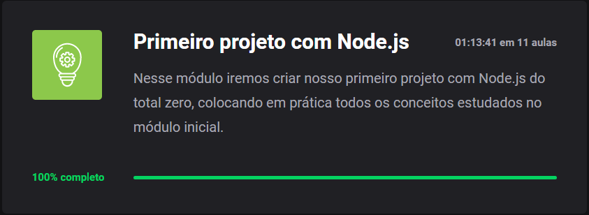

 
<h1 align="center">Projeto FinAPI 💰</h1>

## Tecnologias

- [Express](https://expressjs.com/)
- [Nodemon](https://nodemon.io/)
- [Javascript](https://www.javascript.com/)

## Requisitos

- [x] Deve ser possível criar uma conta
- [x] Deve ser possível buscar o extrato bancário do cliente
- [x] Deve ser possível realizar um depósito
- [x] Deve ser possível relizar um saque
- [x] Deve ser possível buscar um extrato bancário do cliente por data
- [x] Deve ser possível atualizar dados da conta do cliente
- [x] Deve ser possível deletar uma conta
- [x] Deve ser possível retornar o balance

## Regras de negócio

- [x] Não deve ser possível cadastrar uma conta com o CPF já existente
- [x] Não deve ser possível fazer depósito em uma conta não existente
- [x] Não deve ser possível buscar extrato em uma conta não existente
- [x] Não deve ser possível fazer saque em uma conta não existente
- [x] Não deve ser possível excluir uma conta não existente
- [x] Não deve ser possível fazer saque quando o saldo for insuficiente

 

 Feito com 💚 por Ecthon. 

